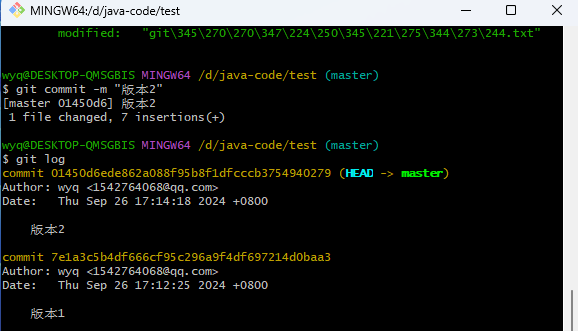
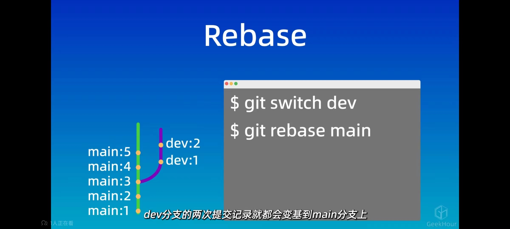
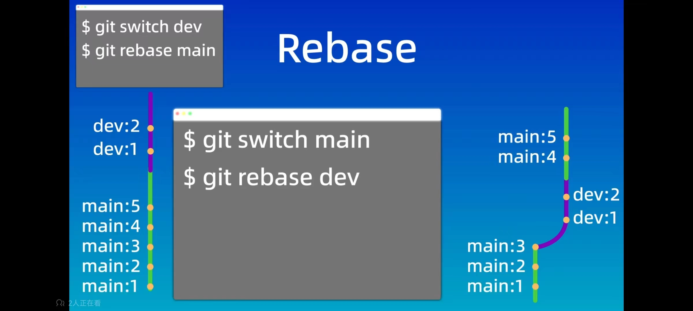

# git

+ 工作区

  git add -工作区添加到暂存区

+ 暂存区

  git commit -暂存区提交到本地仓库

+ 本地仓库

+ 远程仓库

## git config

```bash
# 设置本地仓库用户名
git config --global user.name "xxx"
# 设置本地仓库用户邮箱
git config --global user.email xxx
```

## git init

```bash
# 初始化本地仓库，初始化后默认在master分支
git init
```

# git status

```bash
# 查看分支状态 查看当前分支，需要提交到本地仓库的文件（已添加到暂存区的文件），未添加到暂存区的文件
git status
```

# git add

```bash
# 工作区添加到暂存区
git add .
git add xxx
```

# git commit

```bash
# 将文件由暂存区提交到本地仓库

# vim 输入相关提交信息
git commit
# 输入简短相关提交信息
git commit -m "xxx"
```

# git log

```bash
# 查看commit日志
git log
```




# .gitignore

```bash
创建.gitignore文件
使用正则表达式可以是相应文件不被追踪
```

# git branch

```bash
# 创建新分支
git branch 新分支名
# 查看是否创建成功
git branch
# 切换分支
git checkout 分支名
git switch 分支名
# 删除分支
git branch -d 分支名
# 创建新分支并跳转
git branch -b 新分支名
```

# git merge

```bash
# 将xxx分支的内容合并到当前分支
git merge xxx

```

# git clone

```bash
# 从远程仓库复制到本地仓库
git clone xxxx(url)
```

# git push

```bash
# 把本地仓库内容推送到远程
git push
git push 远程仓库名 远程分支名：本地分支名
```

# git pull

```bash
# 从远程拉取内容到本地
git pull 远程仓库名 远程分支名：本地分支名
```

# git fetch

```bash
# 将远程仓库内容更新本地仓库，但是不会更新工作区
git fetch (可以指定远程仓库和分支名)
```

# git diff

```bash
# 查看不同的分支的区别
git diff origin/main
git diff 远程仓库名/远程分支名
```

# git reset

```bash
# 回退版本
git reset --soft xxx版本号（git log --online查看） 或者 HEAD^（表示回到上一个版本）#回退到某一个版本，保留暂存区和工作区的内容 git ls-files 查看暂存区文件
git reset --hard # 回退到某一个版本，丢弃暂存区和工作区的内容
git reset --mixed # 回退到某一个版本，丢弃暂存区的内容和保留工作区的内容（默认）
```

# git rebase






# 冲突解决

```bash
假设有分支a 分支A(远程分支)
分支a和分支A修改了相同的内容，分支a必须commit以后，再拉取分支A下来，才不会被分支A直接覆盖，而是提示合并冲突。

(可以使用git diff命令查看冲突内容)
命令行 vim 冲突的内容，手动解决冲突(也可以通过vscode解决冲突)
再执行 git add xxx
git commit -m "xxx"

如果想终止合并 git merge --abort


本地的两个分支冲突，远程的分支冲突解决方法一致
```


# 本地仓库和远程仓库

```	bash
# 本地仓库和远程仓库建立关联
#### 已有一个本地仓库 #####
1.新建一个本地仓库
git config ...
git init (默认分支是master)
2.建立一个远程仓库
3.建立本地仓库和远程仓库的关联
git remote add origin https://github.com/wyq007-wyx/GitReview.git
# 将本地分支改名为main
git branch -M main
# 建立本地分支和远程分支的联系
git push -u origin main

#### 已有一个远程仓库 ####
1.创建一个远程仓库（如果没有）
2.git clone 仓库地址
```

